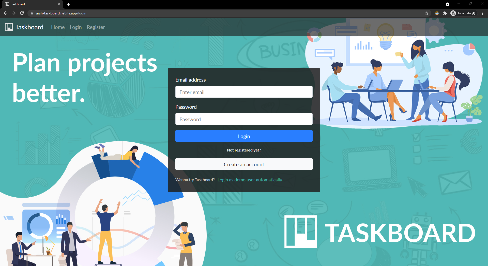
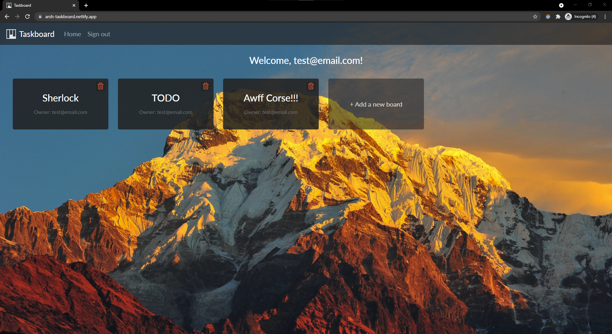
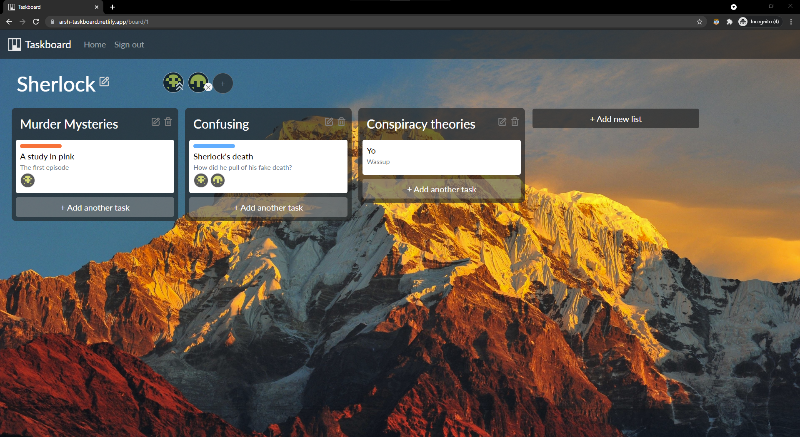

# Taskboard

Taskboard is a Kanban style project management application with drag and drop style card-list User Interface.

## Try it out [here](https://arsh-taskboard.netlify.app/)

> **_NOTE:_**  Please use the **login as demo user** button on the login page for quick login without any signup.

### Key features

- Creating/Deleting multiple project boards per user
- Editing project board name after creation
- Adding/Removing collaborators to a project board
- Adding/Removing lists in a project board
- Updating list names
- Individual Tasks with a title, description, assignees, and a priority level
- Assigning/unassigning individual tasks to one or more collaborators
- Updating tasks
- Drag and drop tasks in same list or different list
